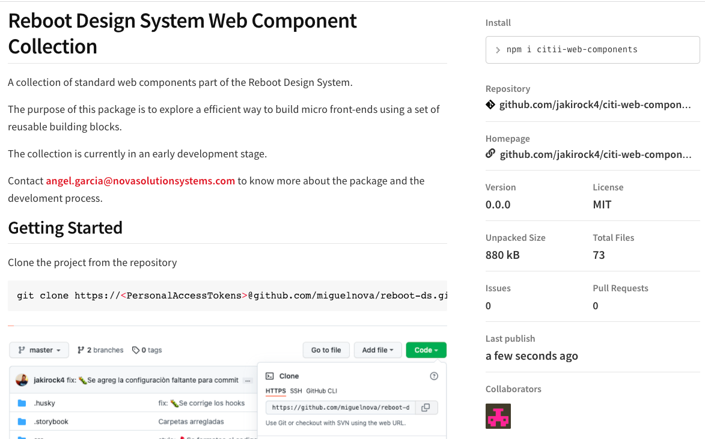

# Bancanet Empresarial - Next Generation

An implementation of standard web components that are part of the reboot design system.

The purpose of this project is to build a web application, with the implementation of web components developed with the StencilJS Framework.

The collection is currently in an early development stage.

Contact angel.garcia@novasolutionsystems.com to know more about the package and the develoment process.

This project was generated with [Angular CLI](https://github.com/angular/angular-cli) version 12.2.8.

Contact angel.garcia@novasolutionsystems.com and alexis.lopez@ids.com.mx to know more about the project and the develoment process.

## Getting Started

Clone the project from the repository

```bash
git clone https://<PersonalAccessTokens>@github.com/miguelnova/bne.git
```

Change directory

```bash
cd bne
```

Donwload package:

```bash
npm i
```

Run the project

```bash
ng serve -o
```

## Implementing a Web Component StencilJS

Install the web component using the NPM package manager

```bash
npm i citii-web-components --dev-save
```



Usage in your Component Angular (app.component.html

```bash
<citi-personal-card
    first-name="Esmeralda"
    last-name="Rodriguez"
    resume="Master en Scrum"
    photo="https://randomuser.me/api/portraits/women/75.jpg"
    role="Project manager"
>
</citi-personal-card>
```

Shown in your Angular web application


## Save changes

Save changes commit

```bash
git add .
npm run commit
```

Types commits

```bash

types: {
      chore: {
        description: 'Build process or auxiliary tool changes',
        emoji: '🤖',
        value: 'chore'
      },
      ci: {
        description: 'CI related changes',
        emoji: '🎡',
        value: 'ci'
      },
      docs: {
        description: 'Documentation only changes',
        emoji: '✏️',
        value: 'docs'
      },
      feat: {
        description: 'A new feature',
        emoji: '🎸',
        value: 'feat'
      },
      fix: {
        description: 'A bug fix',
        emoji: '🐛',
        value: 'fix'
      },
      perf: {
        description: 'A code change that improves performance',
        emoji: '⚡️',
        value: 'perf'
      },
      refactor: {
        description: 'A code change that neither fixes a bug or adds a feature',
        emoji: '💡',
        value: 'refactor'
      },
      release: {
        description: 'Create a release commit',
        emoji: '🏹',
        value: 'release'
      },
      style: {
        description: 'Markup, white-space, formatting, missing semi-colons...',
        emoji: '💄',
        value: 'style'
      },
      test: {
        description: 'Adding missing tests',
        emoji: '💍',
        value: 'test'
      }
    }

```


## Development server

Run `ng serve` for a dev server. Navigate to `http://localhost:4200/`. The app will automatically reload if you change any of the source files.

## Code scaffolding

Run `ng generate component component-name` to generate a new component. You can also use `ng generate directive|pipe|service|class|guard|interface|enum|module`.

## Build

Run `ng build` to build the project. The build artifacts will be stored in the `dist/` directory.

## Running unit tests

Run `ng test` to execute the unit tests via [Karma](https://karma-runner.github.io).

## Running end-to-end tests

Run `ng e2e` to execute the end-to-end tests via a platform of your choice. To use this command, you need to first add a package that implements end-to-end testing capabilities.

## Further help

To get more help on the Angular CLI use `ng help` or go check out the [Angular CLI Overview and Command Reference](https://angular.io/cli) page.
